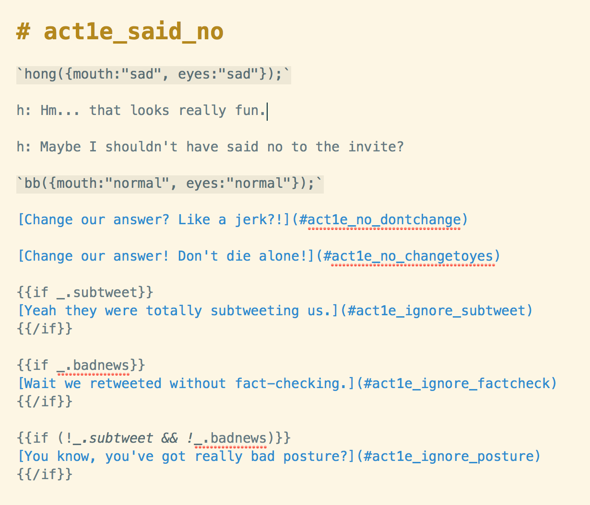
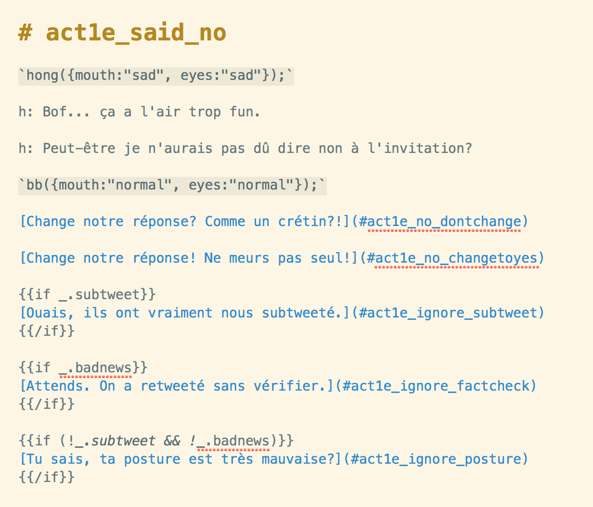
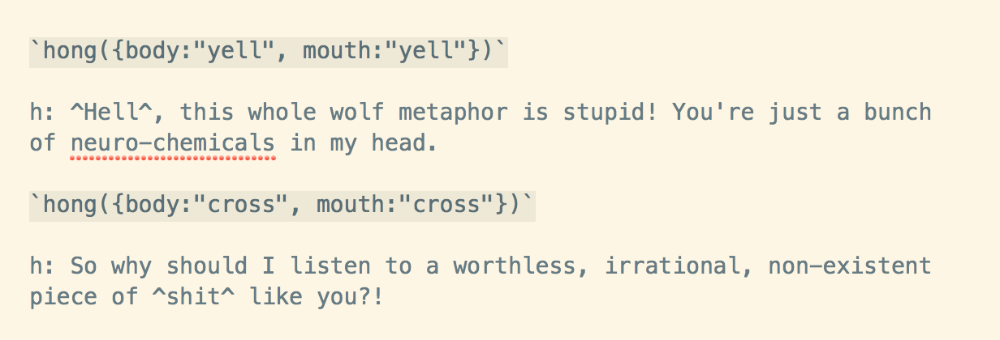
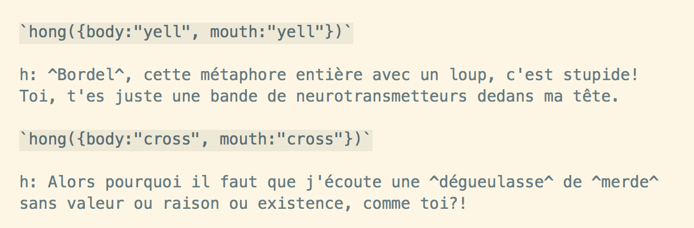
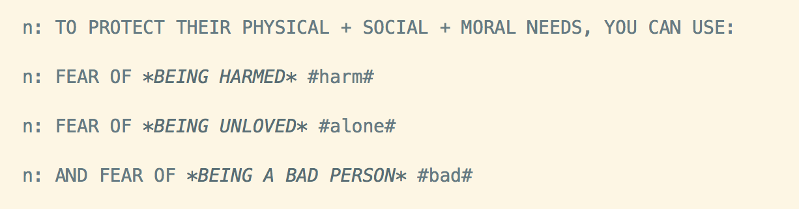
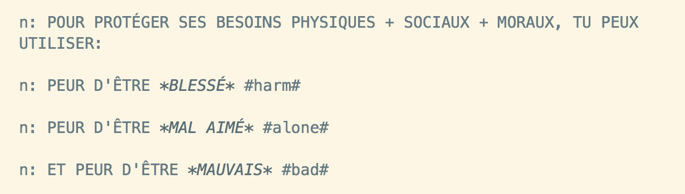
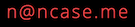

# How to contribute

## Coding Style

Please keep a consistent style, find patterns and attempt to replicate them.

When confused/in-doubt, just ask ncase!

## How To Translate

**TRANSLATIONS COMPLETE:**
[Français](https://nathsom.github.io/ncase-anxiety/),
[Русский](https://notdotteam.github.io/anxiety/),
[Português do Brasil](https://lucasgcb.github.io/anxiety/),
[Deutsch](https://jonasreich.github.io/anxiety/),
[Español (Europeo)](https://jorgeygari.github.io/anxiety/),
[Español (Latino)](https://fantasmashy.github.io/anxiety-Es-La/),
[Türkçe](https://gokdumano.github.io/forks/anxiety/index.html),
[中文](https://z-lyen.github.io/anxiety/),
[中文（臺灣）](https://audreyt.github.io/anxiety/),
[Polski](https://ostapczuk.github.io/anxiety/),
[ภาษาไทย](https://rambanjo.github.io/anxiety/),
[bahasa indonesia](https://ganiaaldi.github.io/anxiety/)
[Українська мова](https://grapto.github.io/anxiety/)

Okay. I super, super seriously apologize in advance.

Translating this thing will *suck.*

Thus, I highly recommend collaborating online on a translation! There's about 9,000 words to translate, the rules of what to translate or not are a bit weird, and you'll need to edit some images. But if you're still up for it...

### Step 0:

[Check the existing issues](https://github.com/ncase/anxiety/issues?utf8=✓&q=is%3Aissue+is%3Aopen+translation) to see if everyone else has already started your desired translation. If someone already started, go help them! :)

### Step 1:

[Make a fork](https://help.github.com/en/articles/fork-a-repo) on Github!

### Step 2:

*POST A GITHUB ISSUE WITH A LINK TO YOUR FORK.* This will let folks a) know a translation is in process, and b) let *you* find collaborators for the translation process!

### Step 3:

Translate all the Markdown files in `/scenes`. (about 9000 words) Personally I use [MacDown](https://macdown.uranusjr.com/) (Mac only), but there's [a whole bunch of other free open-source Markdown editors](https://opensource.com/article/18/11/markdown-editors).

**THERE ARE RULES OF WHAT TO TRANSLATE OR NOT.** It's probably best to show it with examples. Excuse my terrible French...

Original English:



Translated to "Nicky's Attempt At French":



As you can see, you *don't* translate everything.

**Just translate:**

* Anything after a letter + colon. This changes a dialogue *spoken*. "h:" is hong the human, "b:" is beebee the wolf, etc.
* Anything in the square brackets of `[words words words](#section_name)`. This changes the dialogue *choices.*

**Do NOT translate:**

* Anything within ``` `code({with:"backticks",like:"this"});` ```. This is the code that runs between dialogue lines.
* Anything within ``` {{ these brackets either }} ```. These allow for changes in dialogue based on previous choices (see example above).
* Any line that starts with a `#`. That's a section name.
* The part in the *round* brackets in `[words words words](#section_name)`. That's the name of the section you'll go to if you select that dialogue choice.

**Suggestions:**

* Try *NOT* to make any translated line go too much longer than the original. Otherwise dialogue may go off-screen. Paraphrase or cut words if you have to.
* Use asterisks for `*emphasis*`. This will italicize the words in the dialogue! (This is standard Markdown syntax)
* Try to keep pronouns gender-neutral (e.g. English's singular "they") for referring to characters or the player. If your target language doesn't allow that, then flip a coin for each character's gender, or something.

Oh but of *course* that's not all the rules! Two more rules, for swear words:

Original English:



Excusez mon français:



**Rules for translating swears:**

* Put all swear words in `^fucking^ carat symbols`. This is so they can be replaced with @#&!✩@ in the Cuss-Free Mode.
* Beebee the wolf (almost) never swears. They swear a couple times in the perverted Pokémon parody song but that's it. Otherwise, they say "Heck" and "Dang".

**One more dumb rule: Don't translate any words within #pounds#.**

Like so. English:



French:



This was a bad system I have made.

P.S: To jump around different scenes, type `Game.debug()` into the Javascript console.
If you hover over a gray box on the left, you'll see a sidebar that lets you jump to any scene.
(Note: this make break stuff!) You can also uncomment the lines in `main.js` to test out the game
starting from different chapters.

### Step 4:

Translate `index.html`. (about 70 words) There's further instructions in that file itself. (Feel free to add yourself + your collaborators as translators in the top-left corner!)

This translates some UI, and helps search engines + social networks understand the page is in your target language.

### Step 5:

Translate the images. This step sucks. You can use an image-editing program like MS Paint or [GIMP](https://www.gimp.org).

If you don't feel like re-drawing text, [you can find open-source "handwritten" fonts on Google Fonts](https://fonts.google.com/?category=Handwriting). (I used [Sniglet](https://www.theleagueofmoveabletype.com/sniglet) for some text)

Images to translate: (about 70 words)

* `sharing/thumb.png` (so when folks share your game on social media, the thumbnail's in your language! in the same folder, I put a `thumb_no_words.png` image to help you make a new thumbnail.)
* `sprites/about/cc0.png`
* `sprites/about/replay.png`
* `sprites/act4/callback.png`
* `sprites/credits/end_message.png`
* `sprites/credits/screens.png` (feel free to add yourself in closing credits as a translator)
* `sprites/credits/starring.png`
* `sprites/credits/thanks.png`
* `sprites/intermission/youwin.png`
* `sprites/intro/intro_logo.png` (feel free to add yourself in opening credits as a translator)
* `sprites/ui/fear_captions.png`
* `sprites/ui/preloader.png`

### Step 6:

Your translated game is DONE! Now you just need to put it online. You can follow [Github Pages's instructions](https://pages.github.com) for free hosting. (it's the same way I'm hosting my game)

### (OPTIONAL STEP):

This game also has a link to a list of Mental Health Tips & Resources, [on a different webpage](https://ncase.me/mental-health). It's not part of the "main" game, but it may still be valuable to make accessible in more languages.

[The repo & instructions for translating that are here!](https://github.com/ncase/mental-health)

### Step 7: TELL ME YOU ARE *DONE* 🎉🎉🎉

Email me at  so I know you're done!

Do ***NOT*** send a Pull Request to *this* repo, because that will change the *original* game. I will, however, edit the original game to have a link to your translation!

I'm usually busy and/or bad at email, so it'll take me a while to get around to it, but if I don't respond for a week, ping me again!

Thank you you're the beeeeeest 💖🐺💖
